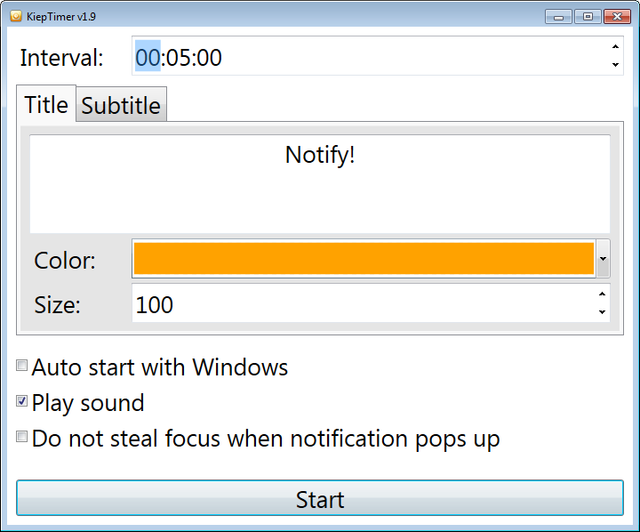
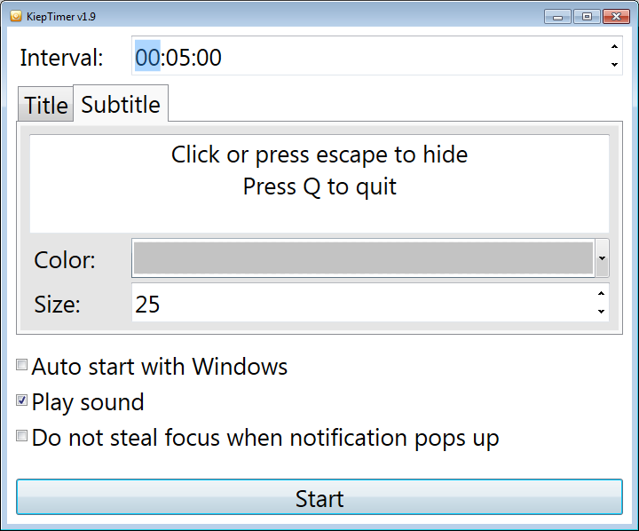

# KiepTimer
### A C# WPF application that shows a notification overlay at a given interval

Features:
 - Screen dimmed and full screen notification overlay
 - Mouseclick or `escape` to hide notification, `Q` to quit
 - Configurable interval between 5 seconds and 24 hours
 - Configurable notification text, color and size
 - Auto start with Windows
 - Notification sound
 - Have notification steal focus or not
 - Shows icon in system tray while in background
 - Dutch and English language support

 
